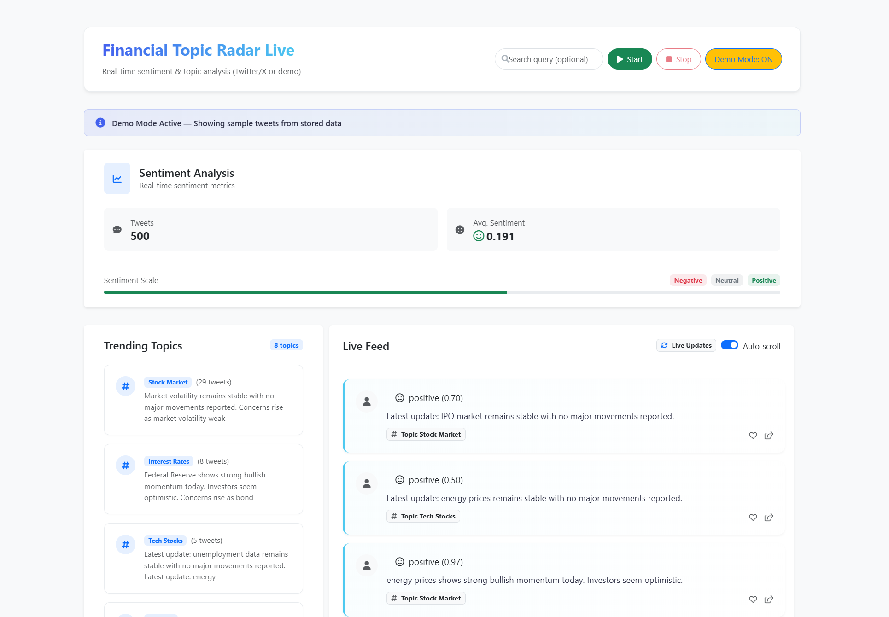

# 📊 Financial Sentiment Analyzer

> Real-time Twitter/X sentiment analysis and topic modeling for financial markets



## 🎯 Overview

A powerful real-time analytics platform that leverages cutting-edge NLP and machine learning to monitor financial sentiment from Twitter/X. Track market mood, discover trending topics, and gain actionable insights from social media chatter about stocks, crypto, forex, and more.

## ✨ Features

- **🔴 Real-Time Streaming** — Live Twitter/X data ingestion with automatic rate limiting
- **🧠 AI-Powered Sentiment** — CardiffNLP's Twitter-RoBERTa model for financial sentiment classification
- **📈 Topic Modeling** — BERTopic + Sentence Transformers for automatic topic discovery
- **📊 Interactive Dashboard** — Beautiful, responsive UI with live updates and sentiment meters
- **🎮 Demo Mode** — Explore with synthetic financial tweets (no API key required)

## 🛠️ Tech Stack

| Category | Technologies |
|----------|-------------|
| **Backend** | Python, Flask, Flask-SocketIO |
| **NLP/ML** | Transformers, BERTopic, Sentence-Transformers, NLTK |
| **Frontend** | HTML5, JavaScript, Bootstrap 5, Animate.css |
| **Data** | Pandas, scikit-learn |
| **API** | Twitter/X API v2 |

## 🚀 Quick Start

### Prerequisites

- Python 3.8+
- Twitter/X API Bearer Token (optional - demo mode available)

### Installation

```bash
# Clone the repository
git clone https://github.com/yourusername/financial-sentiment-analyzer.git
cd financial-sentiment-analyzer

# Create virtual environment
python -m venv .venv
source .venv/bin/activate  # On Windows: .venv\Scripts\activate

# Install dependencies
pip install -r requirements.txt

# Download NLTK data
python -c "import nltk; nltk.download('stopwords')"
```

### Configuration

Create a `.env` file in the project root:

```env
TWITTER_BEARER_TOKEN=your_bearer_token_here
FLASK_SECRET=your_secret_key
```

### Run the Application

```bash
python main.py
```

Open your browser and navigate to `http://localhost:5000`

## 📖 Usage

1. **Start the App** — Launch the Flask server
2. **Choose Mode** — Toggle Demo Mode for testing, or use live Twitter data
3. **Enter Query** (Optional) — Customize your financial search terms
4. **Click Start** — Watch real-time sentiment analysis unfold
5. **Monitor** — Track aggregate sentiment, trending topics, and individual tweets

## 🏗️ Architecture

```
fin-news-analysis/
├── main.py              # Flask application & streaming logic
├── nlp_pipeline.py      # NLP models (sentiment, topics, summarization)
├── x_client.py          # Twitter/X API client
├── templates/
│   └── index.html       # Dashboard frontend
├── static/
│   └── style.css        # Custom styles
├── requirements.txt     # Python dependencies
└── synthetic_financial_tweets.json  # Demo dataset
```

## 🧠 Models Used

| Model | Purpose |
|-------|---------|
| **cardiffnlp/twitter-roberta-base-sentiment** | Financial sentiment classification |
| **all-MiniLM-L6-v2** | Sentence embeddings for topic clustering |
| **facebook/bart-large-cnn** | Topic summarization |
| **BERTopic** | Dynamic topic modeling |

## 📊 Topic Categories

The system automatically classifies tweets into financial topics:

- Interest Rates & Fed Policy
- Inflation & CPI
- Stock Market & Equities
- Earnings Reports
- Cryptocurrency
- Commodities
- Forex
- Mergers & Acquisitions
- Government Policy
- Banking & Finance
- Tech Stocks
- And more...

## 🤝 Contributing

Contributions are welcome! Please feel free to submit a Pull Request.

1. Fork the repository
2. Create your feature branch (`git checkout -b feature/AmazingFeature`)
3. Commit your changes (`git commit -m 'Add some AmazingFeature'`)
4. Push to the branch (`git push origin feature/AmazingFeature`)
5. Open a Pull Request


## 🙏 Acknowledgments

- [CardiffNLP](https://github.com/cardiffnlp) for the Twitter sentiment model
- [BERTopic](https://github.com/MaartenGr/BERTopic) for topic modeling
- [Sentence Transformers](https://www.sbert.net/) for embeddings

---

<p align="center">
  Made with ❤️ for the financial analysis community
</p>
